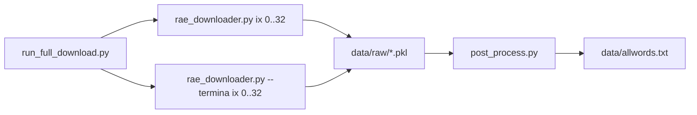

# Spanish Word List from RAE


Spanish word list generated from the public search interface of the Diccionario de la lengua espanola (RAE), with a Python-based scraper and post-processing pipeline.

Tags: python, shell, bash, unittest, lxml, pyuca, scraping, rae, spanish, dictionary, lexicon, nlp, corpus, wordlist

> Last validated against RAE server: 2025-02-10

## Table of contents

- [Quick start](#quick-start)
- [What this repository includes](#what-this-repository-includes)
- [Repository layout](#repository-layout)
- [Main pipeline](#main-pipeline)
- [Complete src catalog](#complete-src-catalog)
- [Tests](#tests)
- [Network behavior](#network-behavior)
- [Limitations](#limitations)
- [Verification checklist](#verification-checklist)
- [Changelog](#changelog)

## Quick start

Install dependencies:

```bash
python -m pip install -r requirements.txt
```

Run full download (empieza por):

```bash
python src/run_full_download.py
```

Run full download with extra coverage (empieza por + termina en):

```bash
python src/run_full_download.py --termina
```

Low-noise mode for long runs:

```bash
python src/run_full_download.py --termina --quiet
```

Final output:

```txt
data/allwords.txt
```

## Run modes at a glance

| Goal | Command |
| --- | --- |
| Full standard run | python src/run_full_download.py |
| Full extended run | python src/run_full_download.py --termina |
| Quiet long run | python src/run_full_download.py --termina --quiet |
| Single index test | python src/rae_downloader.py --ix 0 --quiet |
| Build final txt from existing raw files | python src/post_process.py --inputfile data/raw/allwords --outputfile data/allwords |

## What this repository includes

1. Python scripts to query RAE and build word datasets.
2. Intermediate pickle files under data/raw.
3. Sorted consolidated text outputs under data.
4. Archived snapshots under data/archive.

Main runtime dependencies:

- lxml
- pyuca

## Repository layout

```txt
src/                 Scraper, post-processing, and helper scripts
data/raw/            Intermediate pickle files produced by the scraper
data/archive/        Historical snapshots
data/                Final text outputs
tests/               Unit tests (no live network)
```

## Main pipeline

| Step | Script | Purpose |
| --- | --- | --- |
| 1 | src/rae_downloader.py | Download one letter index into per-letter pickle files |
| 2 | src/post_process.py | Merge, dedupe, sort, and write final UTF-8 txt |
| Orchestrator | src/run_full_download.py | Run step 1 over a range, optional termina mode, then step 2 |



### Common commands

Single letter index download:

```bash
python src/rae_downloader.py --ix 0
```

Single letter index download (quiet):

```bash
python src/rae_downloader.py --ix 0 --quiet
```

Post-process current raw files:

```bash
python src/post_process.py --inputfile data/raw/allwords --outputfile data/allwords
```

Post-process including termina dataset:

```bash
python src/post_process.py --inputfile data/raw/allwords --outputfile data/allwords --termina
```

Run a bounded range in orchestrator:

```bash
python src/run_full_download.py --from-ix 0 --to-ix 32
python src/run_full_download.py --outfile data/raw/allwords --outputfile data/allwords
```

### Notes

1. One execution of src/rae_downloader.py processes one letter index.
2. Default raw files are generated as data/raw/allwords_(letra).pkl.
3. --termina enables the RAE termina en index and merges that dataset in post-process.
4. Full execution can take a long time due to many HTTP requests.

## Complete src catalog

### Active pipeline components

| File | Status | Description |
| --- | --- | --- |
| src/run_full_download.py | Active | End-to-end runner for ranges, optional termina mode, post-processing trigger |
| src/rae_downloader.py | Active | Downloader for one index, prefix-based pagination flow, writes pickles |
| src/post_process.py | Active | Loads pickles, dedupes, sorts with pyuca/allkeys, writes UTF-8 txt |
| src/helpers.py | Active | HTTP/retry and parsing helpers shared by scraper logic |
| src/allkeys.txt | Active | Unicode collation keys used by pyuca |

Relevant helpers in src/helpers.py:

- build_request: request builder with User-Agent.
- get_xtree: HTML fetch/parse with retry and timeout policy.
- try_me_siento_con_suerte: direct-entry check against detail pages.
- extract_conjugacion_forms, has_conjugation, has_page_header_word, is_confirmed_plural: extraction helpers used in tests/helper flows.
- formar_plural and try_plural: helper-level plural logic not used in current production output pipeline.

### Auxiliary and legacy utilities

| File | Status | Description |
| --- | --- | --- |
| src/starting_letter.sh | Utility | Splits 0_palabras_todas.txt by first letter into starting_letter/ |
| src/length.sh | Utility | Splits 0_palabras_todas.txt by length into length/ |
| src/spliter.sh | Legacy | Separates base words, prefixes, suffixes from palabras_todas.txt |
| src/reorder.py | Legacy | Sorts data/0_palabras_todas.txt into data/0_palabras_todas_sorted.txt |
| src/post.py | Legacy | Old post-processing variant based on per-letter pickles |

Recommendation: use src/run_full_download.py + src/post_process.py as the maintained path.

## Tests

The suite covers deterministic logic only and does not hit the live network.

Run tests:

```bash
python -m unittest discover -s tests -v
```

Current coverage:

1. Helper extraction/parsing logic in src/helpers.py.
2. Legacy plural helper rules in src/helpers.py (unit-level only).
3. Command orchestration in src/run_full_download.py.
4. Post-processing with temporary pickle fixtures.
5. Downloader orchestration with mocked dependencies.

Plural test clarification:

1. Plural tests validate formar_plural in isolation.
2. That helper is not part of the current download/post-process production flow.
3. Final datasets are based on RAE responses, not synthetic plural expansion.

## Network behavior

Retry policy is implemented in src/helpers.py.

Defaults:

1. 10 attempts per page.
2. 2-second timeout per HTTP request.
3. 10-second delay between retries.

When all retries fail, the scraper raises RuntimeError with a clear failure signal.

Use --quiet in CLI entry points to reduce logging during long runs.

## Limitations

1. The scraper depends on current RAE HTML/query behavior.
2. Full downloads are network-bound and can take hours.
3. Some historical scripts are retained as legacy utilities.
4. This project scrapes public result pages; review RAE terms and operational limits before large batch runs.

## Verification checklist

After a large run:

1. Validate accented entries are present.
2. Spot-check expected lexical variants.
3. Confirm the final file is sorted and deduplicated.

## Changelog

1. 2026-06-03: Updated generated word datasets (commit fede928).
2. 2026-06-03: Fixed UTF-8 output writing on Windows in post-processing (commit 18ffd35).
3. 2026-06-01: Added quiet mode for long-running scripts (commit 1b37e5e).
4. 2026-06-01: Hardened helper network retries and refreshed docs (commit 0c92fdf).
5. 2026-06-01: Refactored helpers and cleaned dead CLI/import paths (commits 16baa79, 44c6259).
6. 2026-06-01: Refactored downloader and post-process for importable testing (commits 5cdde71, 839968c).
7. 2026-06-01 and 2026-05-31: Expanded tests and workflow documentation (commits 51b6820, 884da13, 9b16e42).
8. 2025-11-19: Updated dictionary against newer RAE data (commit 8991d20).
9. 2024-12-19: Merge and local reorganization batches, including TODO notes for code/server organization (commits a45d074, 6ab9198, e060819, 3bcf7b0).
10. 2024-10-20: Some variable name typos corrected; plural-related checks were explored; word verification updates (ababilla).
